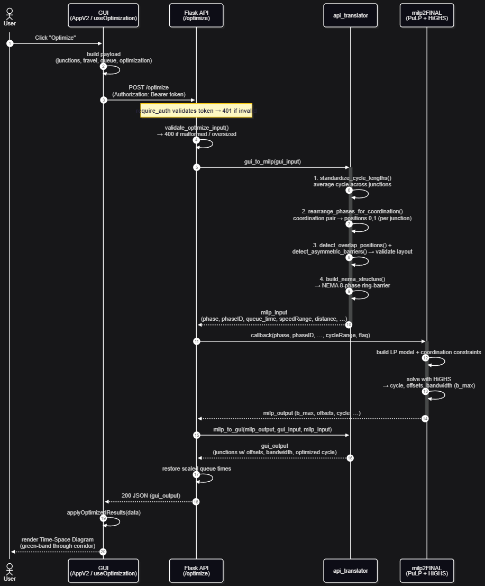

# Architecture & Data Flow

This document explains how Time-Space UI is put together and how data moves
through it — deeper than the `README.md` summary. Read it after the
[`README.md`](../README.md) (setup) and [`CONTEXT.md`](../CONTEXT.md) (domain
glossary). Every domain term below (Corridor, Junction, Phase, Offset, NEMA,
Ring, Barrier, Overlap, Bridge/Exclusive phase, k-factor, flag) is defined in
`CONTEXT.md` — keep it open alongside this.

---

## 1. The 10,000-foot view

```
┌─────────────────────────┐        HTTP (JSON)        ┌──────────────────────────┐
│  Frontend (React+Vite)  │  ───────────────────────► │  Backend (Flask)         │
│  time-space-ui/  :5173  │  POST /optimize           │  APIs/frontendAPI.py     │
│                         │  ◄─────────────────────── │            :5000         │
│  - phase matrix editor  │        GUI JSON           │  - auth, CORS, limits    │
│  - time-space diagram   │                           │  - translation layer     │
└─────────────────────────┘                           │  - calls MILP solver     │
                                                       └────────────┬─────────────┘
                                                                    │ in-process call
                                                                    ▼
                                                       ┌──────────────────────────┐
                                                       │  MILP solver (milp-code/) │
                                                       │  milp2FINAL.callback()    │
                                                       │  PuLP + HiGHS (no license)│
                                                       └──────────────────────────┘
                                          (MongoDB is optional: timing-plan history only)
```

Two servers, one solver. The solver is **not** a separate service — the Flask
backend imports `milp2FINAL` and calls it as a Python function. There is a
*legacy* second Flask app, `APIs/milpAPI.py` (port 4000), that exposes the raw
MILP format without authentication; it is not used by the GUI and must stay on
localhost. The supported entry point is `APIs/frontendAPI.py`.

---

## 2. The central idea: two JSON formats and a translator

Everything important in this project comes from one fact: **the GUI and the
solver speak different languages**, and `api_translator.py` is the interpreter.

| | GUI format | MILP format |
|---|---|---|
| Authored by | Humans / the React app | Machine (the translator) |
| Phases | Flexible **4–6 phases** per junction, with optional overlaps | Strict **NEMA 8-phase** dual-ring ring-barrier |
| Shape | List of `junctions`, each with `phases_s`, `phaseNames`, `outboundIdx`, `inboundIdx`, `offset_s`, `position_m` | Parallel arrays: `phase`, `phaseID`, `phaseRed`, `phaseAmber`, `outbound`, `inbound`, `queue_time`, `distance`, `speedRange`, … |
| Direction convention | Outbound = top-to-bottom (Junction 1 at top) | Outbound = **Ring 1** `[6,5,8,7]`, Inbound = **Ring 0** `[1,2,3,4]` |

> **The single most important thing to understand:** the GUI's direction
> convention is the *opposite* of the solver's. The swap is absorbed in exactly
> one place — `map_inbound_outbound()` in `phase_rearrangement.py` — and is
> documented in [ADR-0001](adr/0001-ring-direction-swap.md). **Do not "fix" the
> solver's ring convention.** If outbound/inbound ever look mirrored, this
> boundary is the first place to look, not the solver.

For why NEMA looks the way it does, see
[`references/NEMA_EXPLAINED.md`](references/NEMA_EXPLAINED.md).

---

## 3. End-to-end request flow (the `/optimize` round trip)

This is the spine of the whole application. Trace it once and the rest follows.



*Sequence of the `/optimize` round trip, from the user's click through the
translator and solver and back to the rendered diagram. The ASCII version below
is the same flow in text; the steps are expanded in §3a–§3c.*

```
 USER clicks "Optimize" in the browser
   │
   ▼
[FE] useOptimization.handleOptimize()                 time-space-ui/src/hooks/useOptimization.ts
   │   - validates (≥2 enabled junctions, sane ranges)
   │   - zeroes phases/queues for suppressed direction on one-way junctions
   │   - snapshots "before" state for the comparison report
   │   - POSTs GUI JSON to /optimize via authFetch (adds bearer token)
   ▼
[BE] optimize()  @require_auth, rate-limited 10/min   APIs/frontendAPI.py
   │   1. validate_optimize_input()  (≤50 junctions, phase 0–300s, …)
   │   2. gui_to_milp(gui_input)     ── translation IN ──┐
   │   4. milp2FINAL.callback(...13 args...)             │
   │   5. milp_to_gui(out, gui_input, milp_input) ── translation OUT ──┐
   │   5b. restore scaled queue times onto the response                │
   │   6. jsonify(gui_output)                                          │
   ▼                                                                   │
[FE] applyOptimizedResults(data)                                       │
   │   - writes offsets, phases, names, in/out indices back to state   │
   │   - records optimized cycle length, shows success toast           │
   ▼                                                                   │
 DIAGRAM re-renders with optimized green bands + comparison report     │
                                                                       │
   gui_to_milp()  ───────────────────────────────────────────────────┘
```

### 3a. `gui_to_milp()` — GUI → MILP  (`api_translator.py:30`)

Order matters; each step depends on the previous one.

1. **Standardize cycle lengths** (`cycle_standardization.standardize_cycle_lengths`)
   — scale every junction to the integer-average cycle so the solver's later
   proportional scaling disturbs user queue times as little as possible.
   Skippable with `standardize=False` (used by tests / `/preprocess`).
2. **Rearrange phases for coordination** (`phase_rearrangement.rearrange_phases_for_coordination`)
   — rotate each junction so its coordination phases land at logical positions
   0,1 (NEMA alignment). **This always runs**, regardless of the `flag` toggle
   (see the gotcha in §6). Includes a validation pass that rejects junctions
   where a non-coordination phase was marked outbound/inbound.
3. **Build the NEMA 8-phase structure** (`nema_builder.build_nema_structure`)
   → `phase`, `phaseID`, `phaseRed`, `phaseAmber`.
4. **Compute distances** from `position_m` (`milp_input_builders.calculate_distances`).
5. **Map inbound/outbound to NEMA IDs** (`phase_rearrangement.map_inbound_outbound`)
   — **this is where the ring-direction swap happens** (ADR-0001).
6. **Format queue times** and **build speed ranges** (`milp_input_builders`).
7. Assemble an **ordered** dict (order is load-bearing for the solver) with
   `k`, `cycleRange`, and `flag` from the optimization config.

### 3b. `milp2FINAL.callback()` — the solver  (`milp-code/milp2FINAL.py`)

Takes 13 positional arguments (see `frontendAPI.py:404`). Builds a PuLP model,
solves with HiGHS, and returns a dict containing `NewCycle`, per-junction
`offset_i`, `Phase`/`Phase_ID` (dual-ring durations, possibly reordered for
lead/lag), `Outbound_bandwidth_actual` / `Inbound_bandwidth_actual`, and
per-segment `Time_Outbound{a}-{b}` / `Time_Inbound{a}-{b}`. Two helpers split
out the non-solver math: `actual_bandwidth.compute_actual_bandwidth` (final
green-band geometry) and `check_constraint.check_coordination_constraint`
(post-solve sanity check of the coordination constraint).

### 3c. `milp_to_gui()` — MILP → GUI  (`api_translator.py:147`)

The hardest function in the codebase. It deep-copies the original GUI input and
fills in optimized values, but to do so it must **reconstruct exactly what the
solver saw**:

- It **re-applies the rearrangement** to the original junction (the MILP output
  is in rearranged/reordered space, not original GUI space).
- It **re-detects overlaps on the rearranged junction** (overlap positions move
  after rearrangement — a frequent source of past bugs).
- It maps NEMA IDs back to phase names, reconstructs GUI phase durations
  *including* overlaps (`nema_builder.reconstruct_phases_with_overlaps`),
  re-inserts overlap phases between their neighbours, and recovers
  `outboundIdx`/`inboundIdx` by phase **name** (not position, because the solver
  reorders).
- Finally it **re-bases all offsets against the master junction** so the master
  junction's `offset_s` is 0 and the rest are relative.

> There is a deliberately **disabled** rotation block (`api_translator.py:434`,
> `TODO(pending-decision)`): rotating the output so outbound sits at GUI index 0
> would corrupt the solver's offset reference. Don't enable it without also
> changing the offset post-processing in `milp2FINAL.py`. See §6.

---

## 4. Module map

### Backend — `APIs/`

| File | Role | Key symbols |
|------|------|-------------|
| `frontendAPI.py` | **Entry point.** Flask app: routes, auth, CORS, rate limits, security headers, run-config safety guard. | `optimize()`, `validate_optimize_input()`, `require_auth`, `resolve_run_config()` |
| `api_translator.py` | Orchestrates the bidirectional translation. **Where most bugs live.** | `gui_to_milp()`, `milp_to_gui()` |
| `cycle_standardization.py` | Pre-scale cycle lengths to their integer average. | `standardize_cycle_lengths()` |
| `phase_rearrangement.py` | Rotate phases to NEMA positions 0/1; map in/out → NEMA IDs. **Holds the ring swap.** | `rearrange_phases_for_coordination()`, `map_inbound_outbound()` |
| `overlap_detection.py` | Detect OVL positions and asymmetric (T-junction) barriers. | `detect_overlap_positions()`, `detect_asymmetric_barriers()` |
| `nema_builder.py` | Build dual-ring NEMA arrays from GUI phases; reconstruct GUI phases from solver output. | `build_nema_structure()`, `reconstruct_phases_with_overlaps()` |
| `milp_input_builders.py` | Build distance / queue / speed arrays. | `calculate_distances()`, `format_queue_times()` |
| `auth.py` | Password hashing (PBKDF2), signed expiring bearer tokens, env-backed user store. | `authenticate()`, `create_token()`, `verify_token()` |
| `hash_password.py` | CLI to generate a password hash for `.env`. | `python APIs/hash_password.py 'pw'` |
| `db.py` | **Optional** MongoDB layer for timing-plan history. App runs fine without it. | `get_project_with_junctions()`, `transform_to_gui_format()` |
| `milpAPI.py` | **Legacy**, unauthenticated raw-MILP API (port 4000). Not used by the GUI; keep on localhost. | — |

### Solver — `milp-code/`

| File | Role |
|------|------|
| `milp2FINAL.py` | **Primary solver.** Variable cycle length + bandwidth maximization. Called by `/optimize`. |
| `milp1FINAL.py` | **Secondary solver.** Fixed cycle length, simpler model. Called by `/optimize/milp1`. |
| `actual_bandwidth.py` | Post-processing: final green-band bandwidth from the optimized plan (pure geometry, no PuLP). |
| `check_constraint.py` | Post-solve verification of the coordination constraint (numerical sanity check). |

> The `FINAL` suffix is historical naming, not a guarantee — treat these as the
> current solvers, full stop. **FILL IN:** confirm whether any earlier
> `milp*.py` variants exist outside the repo that the next engineer might be
> handed; if not, say so explicitly here.

### Frontend — `time-space-ui/src/`

| File | Role |
|------|------|
| `main.tsx` | React entry point. |
| `AppV2.tsx` | **Root component (~1800 lines).** Owns app state: `junctions`, travel/queue arrays, the phase-matrix editor UI, and wiring to the diagram and hooks. |
| `hooks/useOptimization.ts` | Builds the `/optimize` payload, applies results, keeps the before/after snapshot + comparison report. |
| `hooks/useJunctionEditor.ts` | Junction add/edit/preset logic. |
| `hooks/useLocalFolders.ts` | Local (browser) project/folder storage. |
| `hooks/useRemoteProjects.ts` | MongoDB-backed project loading (via `/api/*`). |
| `components/TimeSpaceDiagram.tsx` + `components/diagram/*` | The time-space diagram: signal rows, green bands, queue bands, trajectory overlays. |
| `components/OptimizationSettings.tsx` | The settings panel (cycle range, k-factor, flag, master junction, speeds). |
| `components/OptimizationReport.tsx` | Before/after comparison report UI. |
| `utils/corridorMetrics.ts` | Builds the comparison report (bandwidth, progression efficiency). |
| `utils/trajectory.ts`, `utils/phaseWindows.ts` | Diagram geometry math (unit-tested). |
| `utils/junctionHelpers.ts` | The app-wide `J` junction type + editing helpers. |
| `types.ts` | Diagram-facing shared types (`Junction`, `Margins`). |
| `auth.ts` | `login()` and `authFetch()` (attaches the bearer token). |

---

## 5. The data shapes, concretely

**GUI junction** (what the frontend holds and posts — see `useOptimization.ts`
and `junctionHelpers.ts`):

```jsonc
{
  "id": "j1",
  "name": "Main & 1st",
  "position_m": 0,           // absolute downstream position; distances are derived
  "offset_s": 0,             // pre-opt: phase-0 start; post-opt: relative to master
  "phases_s": [30, 5, 25, 20],      // 4–6 durations, seconds
  "phaseNames": ["A1", "A2", "A3", "A4"],
  "outboundIdx": [0],        // which phase(s) carry outbound coordination
  "inboundIdx": [2],         // which phase(s) carry inbound coordination
  "ovlPhaseIndices": [],     // authoritative overlap positions
  "enabled": true,
  "direction": "bidirectional"  // or "outbound" / "inbound" (one-way)
}
```

**MILP input** (what `gui_to_milp` returns — ordered dict, order matters):
`phase`, `phaseID`, `phaseRed`, `phaseAmber`, `outbound`, `inbound`,
`queue_time`, `k`, `speedRange`, `speedChangeRange`, `distance`, `cycleRange`,
`flag`. Real golden examples live in
`milp-code/tests/fixtures/cases/*.input.json` and `*.golden.json` — read those
to see the exact array shapes for 2-, 3-, 4-junction and T-junction corridors.

---

### 5a. One-way (single-direction) junctions

A junction can run a single coordinated direction instead of both. This is a
**property of the junction**, not a separate mode — set per junction via the
`direction` field:

```
"direction": "bidirectional"   // default — both directions coordinated
"direction": "outbound"        // → Out only  — inbound suppressed
"direction": "inbound"         // ← In only   — outbound suppressed
```

The dropdown lives in the phase-matrix panel (`AppV2.tsx`, the
`↔ Bidir / → Out only / ← In only` select). "Suppressed" below means the
direction that is *not* coordinated for that junction.

#### The rule

One-way does **not** restructure the junction. `phaseID` stays fully populated
in both rings — no phase is deleted and the index arrays are not emptied. The
junction keeps its standard NEMA layout; the suppressed direction is expressed
purely by **zeroing the durations of its coordination column** (and that
column's clearance and queue time):

- The suppressed direction's coordination phase occupies one **column** of the
  dual-ring structure. Zero that **whole column across both rings** in `phase`,
  and likewise in `phaseRed` and `phaseAmber`.
- Zero the suppressed direction's **queue time**.
- `phaseID` is left untouched.

Worked example — `phaseID = [[1,2,3,4],[6,5,8,7]]`,
`phase = [[20,20,20,20],[20,20,20,20]]`, `outbound:[2]`, `inbound:[6]`. NEMA 2
(outbound coordination) sits at **column 1** (ring0 holds `2`, ring1 holds its
concurrent `5`). If the road is **inbound-only** (outbound suppressed), zero
column 1 in both rings:

```
phaseID : [[1,2,3,4],[6,5,8,7]]          // unchanged
phase   : [[20, 0,20,20],[20, 0,20,20]]  // column 1 zeroed in BOTH rings
phaseRed/phaseAmber : column 1 → 0 in both rings
queueOut (suppressed dir) : 0
```

#### How the code produces this

1. **Optimization payload (`useOptimization.ts` → `handleOptimize`).** For a
   one-way junction it zeros the GUI `phases_s` entry of the suppressed
   direction's phase(s), and zeros that direction's queue:

   ```ts
   // inbound-only: zero outbound-exclusive phases (outbound suppressed)
   j.outboundIdx.forEach(i => { if (!j.inboundIdx.includes(i)) phases_s[i] = 0; });
   // outbound-only: zero inbound-exclusive phases
   j.inboundIdx.forEach(i => { if (!j.outboundIdx.includes(i)) phases_s[i] = 0; });
   ```

   Queue: `optQueueOut` = 0 when `inbound`, `optQueueIn` = 0 when `outbound`.
   `tao` (queue clearance) appears in the coordination-constraint RHS, so a
   non-zero value for the dead direction would bias the active one. The same
   zeroing is repeated server-side in `optimize()` / `gui_to_milp`.

2. **The whole column drops out automatically.** Both NEMA rings are built from
   the *same* `phases_s` (`nema_builder.py` → `parse_phases_with_overlaps`:
   `ring0 = ring1 = list(phases_s)`), so zeroing one GUI phase zeros that
   column in **both** rings — exactly the rule above. `build_nema_structure`
   then sets `phaseRed`/`phaseAmber` to 0 for any position whose duration is 0
   (`nema_builder.py:230–233`), so the clearance follows for free. `phaseID` is
   never derived from durations, so it stays intact.

3. **Diagram view (read-only transform).** Independently, before rendering, the
   suppressed direction's coordination indices are emptied so no green band or
   trajectory is drawn (`AppV2.tsx` → `diagramJunctions`):

   ```ts
   outboundIdx: (j.direction === "inbound")  ? [] : j.outboundIdx,
   inboundIdx:  (j.direction === "outbound") ? [] : j.inboundIdx,
   ```

   The editor panels also hide the suppressed direction's queue input and its
   OUT/IN markers (the `direction !== "inbound"` / `!== "outbound"` guards).
   This is **view-only** and does not change the stored junction.

**Mental model:** bidirectional ↔ one-way is the same data path. One-way just
feeds the solver a junction whose suppressed coordination column is zeroed (green
time, clearance, queue), with NEMA IDs untouched. Nothing special happens inside
the MILP.

> **Note on the `oneway_*` solver fixtures.** `milp-code/tests/fixtures/cases/
> oneway_outbound_suppressed.*` and `oneway_inbound_suppressed.*` are
> **hand-authored MILP-level inputs** for solver characterization — they do not
> pass through `gui_to_milp`, so they zero only the suppressed coordination
> cell rather than the full GUI-derived column. Don't treat them as the
> reference for the column rule above; the GUI translation path is.

---

### 5b. Asymmetric (T-junction) merges are barrier-scoped — and the rotation workaround

**This is not a bug — read this before "fixing" it.** An asymmetric merge (the
spanning OUT/IN pill in the phase matrix, where one phase serves both directions
and its neighbour serves only one) can **only** form **within a single NEMA
barrier**, never across the boundary between barriers.

Phases are paired into barriers two at a time by position:

```
barrier 0 = phases (0,1)   →  A1, A2
barrier 1 = phases (2,3)   →  A3, A4
```

The detection loop (`AppV2.tsx`, `PhaseMatrixV2` / `CollapsedPhaseStrip`, and the
backend `overlap_detection.detect_asymmetric_barriers`) walks barriers, not
arbitrary neighbours:

```ts
for (let b = 0; b < 2; b++) {
  const p0 = b * 2, p1 = b * 2 + 1;   // (0,1) then (2,3) — barrier-aligned only
  ...
}
```

So a merge of **A2 + A3** (indices 1 and 2) is *cross-barrier* — it straddles the
barrier-0 / barrier-1 boundary — and is intentionally not detectable. NEMA's
ring-barrier model does not allow a coordinated movement to span a barrier, so
this restriction is correct, not a missing feature.

#### Workaround: rotate the phase sequence so the two phases share a barrier

A signal cycle is **cyclical** — `A1 → A2 → A3 → A4 → A1 → …` is the *same*
physical plan regardless of which phase you label "first." Rotating the start
point therefore produces an identical input to the solver (same phase order, same
durations, same offsets relative to each other) while changing which phases land
in which barrier.

So to merge two phases that are currently split across a barrier, **drag the
chips** (the phase matrix supports reordering via drag — `reorderPhase` in
`junctionHelpers.ts` moves the duration, name, and OUT/IN flags together) to
rotate the unwanted boundary out from between them.

**Worked example.** You want `outbound: A2`, `inbound: A2, A3` — i.e. merge A2
(the bridge, serves both) with A3 (inbound only). As entered:

```
index :   0    1    2    3
phase :   A1   A2 | A3   A4        ("|" = barrier boundary)
          └ barrier 0 ┘ └ barrier 1 ┘
```

A2 (idx 1) and A3 (idx 2) sit in different barriers → no merge possible.

Drag **A1** to sit after **A4**, rotating the sequence to `A2, A3, A4, A1`:

```
index :   0    1    2    3
phase :   A2   A3 | A4   A1
          └ barrier 0 ┘ └ barrier 1 ┘
```

Now A2 (idx 0) and A3 (idx 1) are both in **barrier 0**, the asymmetric pair is
detected, and the spanning IN pill renders / exports correctly. Because the cycle
is rotation-invariant, this is the same junction you started with — only the
chosen "phase 0" changed.

> **Rule of thumb for users:** if the two phases you want to merge are not both in
> `(A1,A2)` or both in `(A3,A4)`, rotate the chips until they are. For the next
> engineer: do **not** "generalise" the detection loop to scan arbitrary
> consecutive pairs — that would emit cross-barrier merges the NEMA backend
> cannot represent.

---

## 6. Gotchas & landmines (read before changing anything)

These are the things that are not obvious from the code and have bitten people:

1. **The "Phase Rearrangement" toggle does NOT control phase reordering.**
   Despite the UI label, phase rearrangement to NEMA positions 0/1 runs
   *unconditionally* in `gui_to_milp`. The `flag` (0/1) only controls whether
   the *solver* may pick the lead/lag pattern. See `CONTEXT.md` →
   "Phase Rearrangement" and "Lead/lag pattern".

2. **Ring-direction swap is intentional** (ADR-0001). GUI outbound → MILP Ring 1,
   GUI inbound → MILP Ring 0. Never change the solver to "match" the GUI.

3. **Overlap positions move after rearrangement.** Any code on the MILP side
   that reasons about overlaps must detect them on the *rearranged* junction,
   not the original. `milp_to_gui` does this deliberately; preserve it.

4. **`milp_to_gui` reconstructs, it doesn't just copy.** It re-runs
   rearrangement and overlap detection to recover what the solver saw. If you
   change `gui_to_milp`'s rearrangement, you must change the reconstruction in
   lockstep — the golden tests are your guardrail (§7).

5. **The disabled output rotation** (`api_translator.py:434`). Enabling it
   corrupts offsets unless you also change `milp2FINAL.py`'s offset
   post-processing. It is a coupled, two-sided change. Don't do it casually.

6. **`flag` default mismatch.** The frontend default is `flag: 0`
   (`useOptimization.ts`), but `gui_to_milp` defaults to `flag=1` when the key
   is absent. The frontend always sends it, so this only matters for direct API
   callers — be aware when writing scripts/tests.

7. **One-way junctions zero out the suppressed direction** before sending
   (`useOptimization.ts` and again server-side in `optimize()`/`gui_to_milp`).
   Queue times for the suppressed direction are zeroed too, because `tao`
   appears in the coordination-constraint RHS and would bias the active
   direction otherwise. Full mechanism and the column-zeroing rule are in
   **§5a. One-way junctions**.

   7b. **Asymmetric merges can't span a barrier — that's intentional.** A merge
   of, say, A2+A3 won't form because they sit in different NEMA barriers. It is
   not a bug, and the detection loop must stay barrier-scoped. Users merge such
   phases by rotating the (cyclical) phase order via chip drag so both land in
   one barrier. Full explanation + worked example in **§5b**.

8. **Queue times aren't echoed by the solver.** `milp_output` doesn't return
   `queue_time`, so `optimize()` restores the scaled queue values from
   `milp_input` onto the response (`frontendAPI.py:427`). Don't remove that
   step or queues render as zero.

9. **`api_translator` imports its siblings by bare module name** (e.g.
   `from overlap_detection import ...`). This works because `frontendAPI.py`
   adds `APIs/` to `sys.path` implicitly (same dir) and `milp-code/` explicitly.
   Run backend code from the repo root / via the documented commands, or imports
   break.

> **FILL IN (you, before handover):** add any other "looks wrong but is
> intentional" items you remember — numerical tolerances, sign conventions in
> the solver, browser quirks in the diagram, etc. This section is the highest-
> value part of the whole handover.

---

## 7. Tests as the safety net

The translation round trip is covered by **golden / characterization tests** —
the most important guardrail in the repo:

- `APIs/tests/` — translator, auth, validation, rate-limit, security config.
- `milp-code/tests/` — `test_milp2_characterization.py` and
  `test_rearrange_characterization.py` compare solver/rearrangement output
  against `fixtures/.../*.golden.json` for many corridor shapes (2/3/4-junction,
  T-junction asymmetry, one-way suppression, every lead/lag × barrier
  combination).

**The rule for the next engineer:** if you change the translator or solver and a
golden test fails, that is the test doing its job. Only regenerate goldens
(`milp-code/tests/generate_goldens.py`, `generate_rearrange_goldens.py`) when
you have **intentionally** changed behavior and have verified the new output is
correct — never to "make the tests pass."

Run everything:

```powershell
python -m pytest APIs/tests milp-code/tests     # backend
cd time-space-ui; npm test                       # frontend (vitest)
cd time-space-ui; npm run typecheck              # TS types
```
</content>
</invoke>
